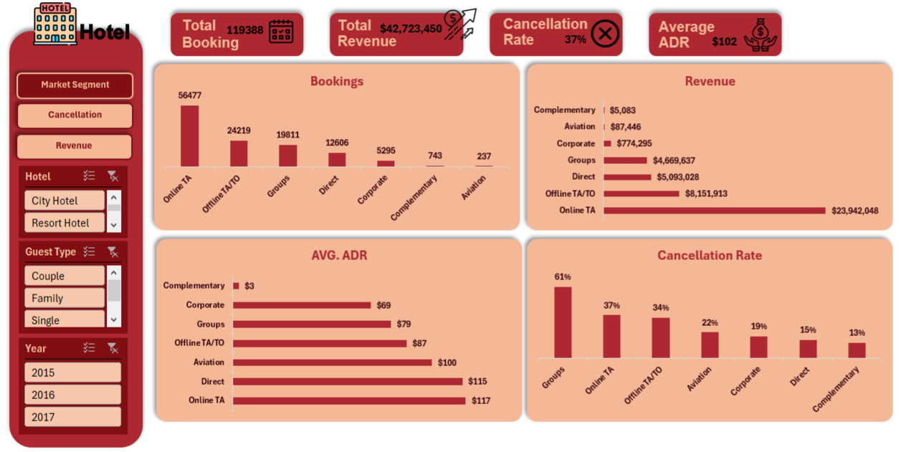
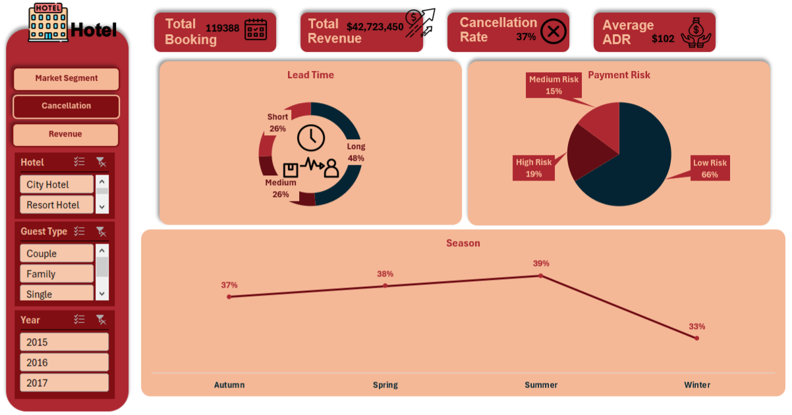
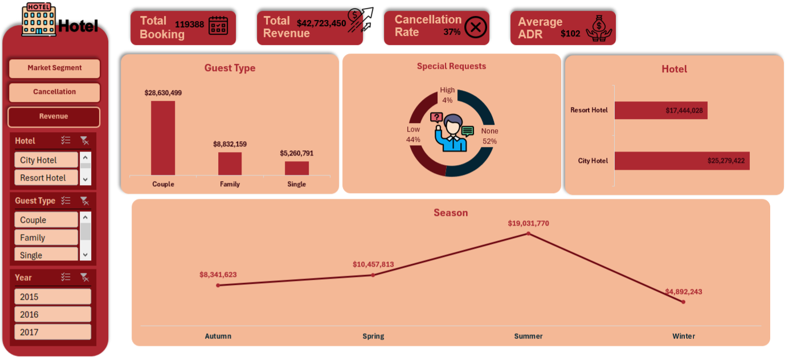

# 🏨 Hotel Booking Analysis Dashboard

An interactive **Hotel Booking Analysis Dashboard** built using **Microsoft Excel** to analyze hotel booking data, revenue performance, cancellation behavior, and customer patterns.

The dashboard transforms raw hotel booking data into clear and interactive visual insights that help understand booking trends, revenue sources, cancellation behavior, and customer characteristics.

---

## 📌 Project Overview

This project analyzes hotel booking data for two hotel types:

- City Hotel
- Resort Hotel

The dashboard provides an interactive way to explore the data using different filters and visualizations.

The analysis focuses on:

- Booking volume
- Revenue performance
- Average Daily Rate (ADR)
- Cancellation rate
- Market segments
- Guest types
- Lead time
- Payment risk
- Special requests
- Seasonal trends
- Hotel performance

---

## 📊 Dashboard Pages

The dashboard consists of three main analytical pages:

### 1. Market Segment Analysis

This page analyzes booking and revenue performance across different market segments.

It includes:

- Bookings by Market Segment
- Revenue by Market Segment
- Average ADR by Market Segment
- Cancellation Rate by Market Segment

Market segments include:

- Online TA
- Offline TA/TO
- Groups
- Direct
- Corporate
- Complementary
- Aviation



---

### 2. Cancellation Analysis

This page focuses on understanding cancellation behavior and identifying booking-related risks.

It includes:

- Lead Time Distribution
- Payment Risk Analysis
- Cancellation Rate by Season

Lead time is categorized into:

- Short
- Medium
- Long

Payment risk is categorized into:

- Low Risk
- Medium Risk
- High Risk



---

### 3. Revenue Analysis

This page provides a deeper analysis of revenue generation and customer behavior.

It includes:

- Revenue by Guest Type
- Special Requests Distribution
- Revenue by Hotel
- Revenue by Season

Guest types include:

- Couple
- Family
- Single

The page also compares revenue performance between:

- City Hotel
- Resort Hotel



---

## 📈 Key Performance Indicators (KPIs)

The dashboard provides four main KPIs:

| KPI | Description |
|---|---|
| **Total Bookings** | Total number of hotel bookings |
| **Total Revenue** | Total revenue generated from bookings |
| **Cancellation Rate** | Percentage of bookings that were cancelled |
| **Average ADR** | Average Daily Rate of hotel bookings |

The dashboard currently shows:

- **Total Bookings:** 119,388
- **Total Revenue:** $42,723,450
- **Cancellation Rate:** 37%
- **Average ADR:** $102

---

## 🎛️ Interactive Filters

Users can dynamically filter the dashboard using:

- **Hotel**
  - City Hotel
  - Resort Hotel

- **Guest Type**
  - Couple
  - Family
  - Single

- **Year**
  - 2015
  - 2016
  - 2017

These filters allow users to explore specific segments of the hotel booking data and understand how different factors affect bookings, revenue, and cancellations.

---

## 🔍 Key Insights

The dashboard helps identify several important patterns in the hotel booking data:

- **Online TA** generates the highest number of bookings and the highest revenue among market segments.
- **City Hotel** generates higher revenue compared with Resort Hotel.
- **Summer** represents the strongest season in terms of revenue.
- **Groups** have the highest cancellation rate among the market segments.
- Most bookings fall under the **Low Payment Risk** category.
- **Couples** contribute the largest share of revenue among guest types.
- Long lead-time bookings represent the largest lead-time category.

---

## 🛠️ Tools & Technologies

- **Microsoft Excel**
- Excel Pivot Tables
- Excel Charts
- Slicers
- Data Cleaning & Analysis
- Dashboard Design
- Data Visualization

---

## 🎯 Project Objectives

The main objectives of this project are to:

1. Analyze hotel booking patterns.
2. Understand the main sources of revenue.
3. Identify market segments with high booking and cancellation rates.
4. Compare City Hotel and Resort Hotel performance.
5. Analyze seasonal booking and revenue trends.
6. Understand customer behavior based on guest type and special requests.
7. Identify potential booking and payment risks.
8. Present business insights through an interactive dashboard.

---

## 📂 Repository Structure

```text
hotel-booking-analysis-excel/
│
├── Screenshots/
│   ├── Market.png
│   ├── Cancellation.png
│   └── Revenue.png
│
├── hotel_rawdata.xlsx
│
└── README.md
